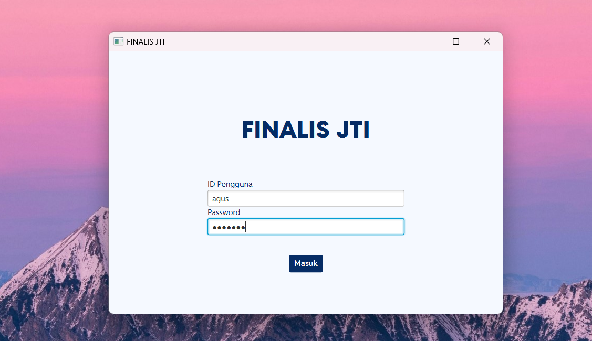

# Dokumentasi Bagi Developer

Halaman ini menyajikan dokumentasi bagi developer. Jika anda mencari topik spesifik berkaitan dengan hal teknis proyek, anda bisa melihat submenu berikut:
- [Basis data](database.md)
- [UI/UX](ui-ux.md)
- [Frontend](frontend.md)
- [Backend](backend.md)

---

## Cara Pemasangan

### Kebutuhan Pengembangan
Berikut adalah spesifikasi minimum untuk mengembangkan aplikasi ini: 

| Jenis | Nama                 | Versi  |
| -- |----------------------|--------|
| Bahasa pemrograman | Java                 | 22.0.2 |
| Framework | JavaFX               | 23.0.1 |
| Basis data | Microsoft SQL Server | 2022   |
> Direkomendasikan untuk menggunakan IDE [IntelliJ IDEA](https://www.jetbrains.com/idea/) untuk kemudahan dalam konfigurasi awal proyek

### Langkah Instalasi

Langkah-langkah untuk menjalankan proyek di lokal:
1. Kloning repositori

   Bka terminal pada direktori tersebut. Kemudian ketikkan perintah di bawah:
    ```bash
    git clone https://github.com/andromeda-hebat/FINALIS-JTI-ADMIN.git
    ```
2. Jalankan aplikasi dengan menjalankan tombol **Run** pada IDE yang anda gunakan. 

   Pastikan aplikasi sudah bisa menampilkan window untuk login berikut:

   
   

---

## Struktur Proyek

```bash
FINALIS-JTI-ADMIN
├───.idea
├───.mvn
├───docs
│   ├───assets
│   └───guides
├───src
│   └───main
│       ├───java
│       │   └───andromeda
│       │       └───hebat
│       │           └───finalisjtiadmin
│       │               ├───controllers
│       │               ├───core
│       │               ├───helper
│       │               ├───models
│       │               └───repository
│       └───resources
│           ├───components
│           ├───css
│           ├───icons
│           ├───img
│           └───views
└───target

```